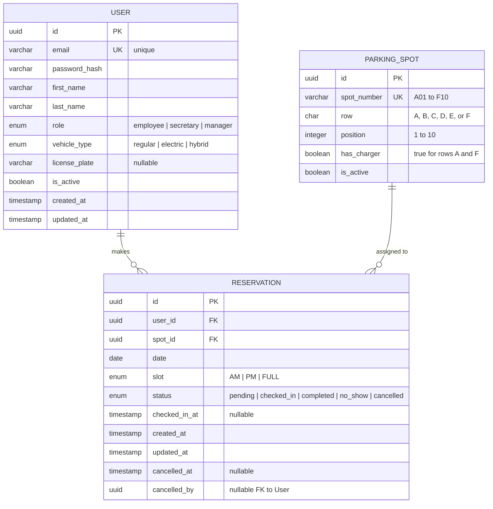

# Entity-Relationship Diagram

## Data Model

## Notes

- **Unique constraint** on `(spot_id, date, slot)` to prevent double booking
- A `FULL` day slot conflicts with both `AM` and `PM` — enforced at the application level (see ADR-007)
- Rows A and F have `has_charger = true`, all others `false`
- Reservations are never hard-deleted — status transitions track the full lifecycle (see ADR-008)
- `cancelled_by` references the User who performed the cancellation (the employee themselves or a secretary)

## Parking Spot Seeding

60 spots total: 6 rows × 10 positions

| Row | Spots | Electric Charger | Position |
|-----|-------|-----------------|----------|
| A | A01–A10 | Yes (wall row) | Border |
| B | B01–B10 | No | Central pair with A |
| C | C01–C10 | No | Central pair with D |
| D | D01–D10 | No | Central pair with C |
| E | E01–E10 | No | Central pair with F |
| F | F01–F10 | Yes (wall row) | Border |

Layout: `[A B | C D | E F]`
